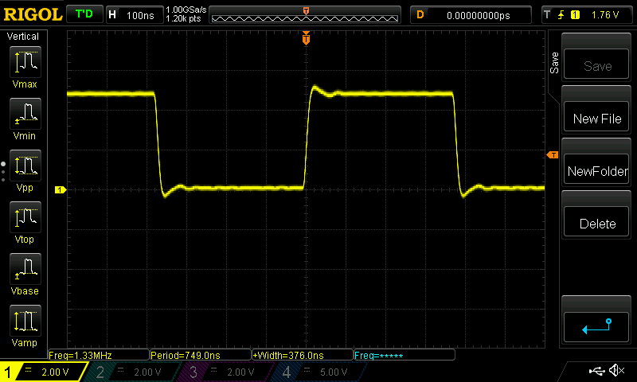

### Simple demo of AVR instruction timing

From the `atmega328p` datasheet from "Instruction Set Summary" we can get number
of clocks per each instruction:

```text
# 1 cycle
  88:	85 b1       	in	r24, 0x05	; 5
# 1 cycle
  8a:	89 27       	eor	r24, r25
# 1 cycle
  8c:	85 b9       	out	0x05, r24	; 5
# 1 cycle
  8e:	00 00       	nop
# 2 cycle
  90:	fb cf       	rjmp	.-10     	; 0x88 <main+0x8>
```

Clock frequency is 16MHz

Total: 6 cycles * 1/16000000 [s] = 3.75e-7 [s] (0.375 [us] or 375 [ns])

Therefore, our loop takes 375 nanoseconds. We can verify it with oscilloscope:


